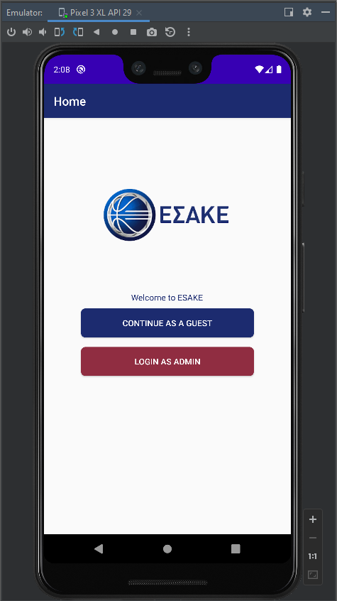
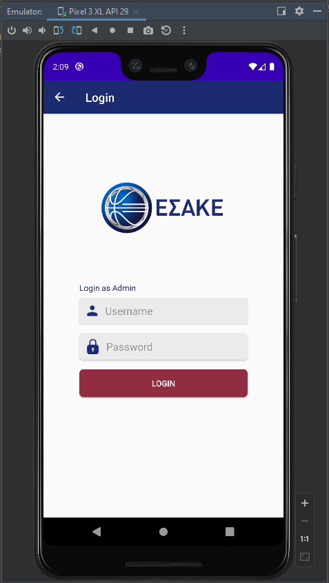
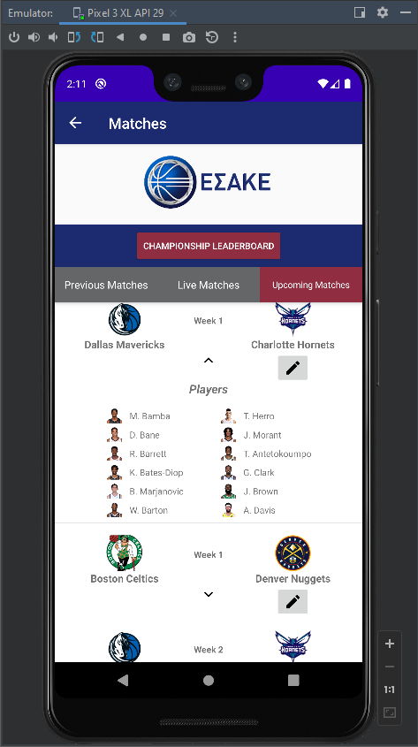
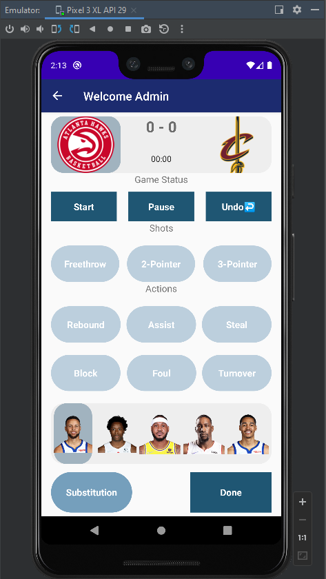
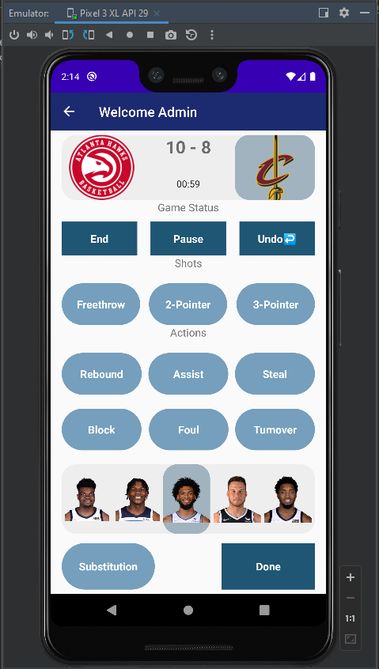
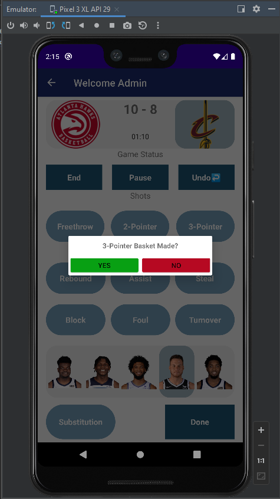
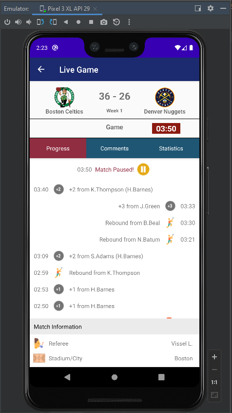
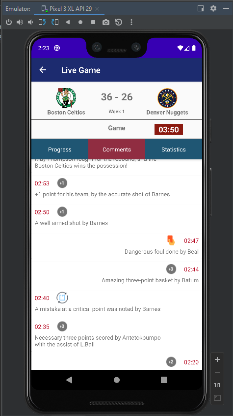

# WeBall Statistics

<h4>The WeBall Statistics application is a league statistics application for basketball, which was created as part of the course "Apps development for Mobile Devices" (University of Macedonia - Applied Informatics, academic year 2021-2022, 6th semester).</h4>
<h4>Part of the course, was to get organized into groups of 10 people. Our team (#Team 2) consists of the following students alphabetically:</h4>
<ul>
  <li><b><i>Ampatzidou Elisavet</i></b></li>
  <li><b><i>Charakopoulos Minas - Theodoros</i></b></li>
  <li><b><i>Dasyra Evmorfia - Elpida </i></b></li>
  <li><b><i>Iordanou Sofia</i></b></li>
  <li><b><i>Lougaris Dionisis </i></b></li>
  <li><b><i>Lousta Aravella</i></b></li>
  <li><b><i>Machairas Panagiotis</i></b></li>
  <li><b><i>Ouzounidis Kyriakos</i></b></li>
  <li><b><i>Pepa Leonard</i></b></li>
  <li><b><i>Stefou George-John</i></b></li>
</ul>

<h4>Video presentation of the app on YouTube: <a href="https://www.youtube.com/watch?v=ouzMwkUCQ-s&list=LL&index=12"><b><i>presentation video</i></b><a/></h4>
<h4>Visit the other repo, with the back-end of our application: <a href="https://github.com/uom-android-team2/WeBall_Statistics-Backend"><b><i>back-end</i></b><a/></h4>

<h2>R1 &nbsp;&nbsp; Display matches - Admin Login - Guest Starting Page</h2>

  
  
  

 

<b><i>Requirement 1</i></b> is handled by the administrator (admin) and it concerns the match selection, and manage the card of the selected match. This includes the appearance of players and the corresponding ones logos. First, the administrator must enter the username and password in the form is requested, after choosing the button “LOGIN AS ADMIN". The admin account can created by the backend website through it register. It then goes to the “Matches” screen, where there are three columns with the corresponding matches (Previous Matches, Live Matches, Upcoming Matches). From there the administrator can choose a match and edit the tab of. More specifically, by pressing it arrow a popup appears menu, which includes the players of the groups. With the edit button, is transferred to the “Welcome Admin” screen, where it is match management (see R2).  
Note: The edit option concerns ONLY the live and upcoming matches, not the completed.

<h2>R2 &nbsp;&nbsp; Match management by Admin</h2>

  
  
  

 

<b><i>Requirement 2</i></b> constitutes the next possibility of the administrator (admin), which includes all functions related to managing a match (Shoot with
type and result, Rebound or Assist or Block, Steal, Turnover and Foul). Necessary condition for starting the game, but also to activate the buttons, it is to click the button "Start". After it's click, the same button turns into “End”, through which the match could be terminated. In addition, the administrator can stop the timer and start it (from where you stopped it) via the “Pause” button, the which turns into “Continue” when pressed, and vice versa. Still, for registering any action, it is necessary, the administrator to follow a series of steps. Initially, the administrator during his navigation on this screen, sees the home team selected (by default). To if he can change team, he uses the Banner of which located at the top as an image. Once he selects any from the 2 teams, the key players of the selected team, appear at the bottom of the screen. In the same way that the team is selected, a player can also be selected, that is, by clicking on his image.  
Note: The match does not end when "Done" is pressed. Only will paused and the admin will moved back to all matches.

<h2>R3 &nbsp;&nbsp; Recording statistics</h2>

This particular requirement deals with calculating stats for players and the groups, when the administrator performs a corresponding action. These actions include the basic events that occur in a match basketball skills such as free throws and attempts (two-pointers, three-pointers). In addition, assists, rebounds, steals, cuts, fouls are also recorded and mistakes. The specific statistics are recorded in the database at the moment which the administrator presses a similar button from its graphical interface which is fragment_admins_view. Statistics recording can begin the moment a match is live. For something like this to happen, it is necessary o
administrator to press the start button from its graphical interface. On the contrary, if the administrator seeks to increase statistics for a player, team respectively buttons will be disabled. Beyond the simple recording of statistics n application modifies the above data into a more logical form for the user. Specifically, in the frontend, a percentage calculation is also carried out through a condition. To if the application succeeds in the specific process, it stores its data in classes statistics for players and teams from the database.

<h2>R4 &nbsp;&nbsp; Watch the progress of the Live Match</h2>

  
  
  

 

The purpose of implementing <b><i>requirement 4</i></b> is that users as well as match administrators (admins) can watch the progression of a live match in real time, through verbal descriptions and comments for more details. In order to watch the progress of a live match, one must first choose one, from the list of live matches (Live matches), by clicking anywhere on its layout. Thus, it will be transferred to a new screen, where the 2 teams, the current score, the match week, as well as the current minutes of the match, are shown above. Below, is a menu available where gives the opportunity to watch the match through brief descriptions by selecting the "Progress" tab, as well as through comments and more detailed descriptions by pressing the "Comments" tab. He can also see the statistics of the teams and the respective players by going to the "Statistics" tab (R5).   
About the <b><i>"Progress"</i></b> tab, short descriptions are displayed for actions registered by the admin and performed in the match such as the following: 

<ul>
  <li>Start, complete, pause and resume of the match.</li>
  <li>Successful freethrow, 2-point and 3-point</li>
  <li>Rebound</li>
  <li>Steal</li>
  <li>The name of the player who made the Assist in parentheses (only for 2 points or 3 points).</li>
  <li>Block</li>
  <li>Foul</li>
  <li>Turnover</li>
  <li>Player Substitution</li>
</ul>

About the <b><i>"Comments"</i></b> tab, all actions previously mentioned in the “Progress” tab are described in the form of comments with the extra addition of the display of missed free throws, 2-points and 3-points.

Left-aligned descriptions refer to the home team, right-aligned to the away team and in the center there are descriptions generally related to the flow of the match without specifically addressing any team.

<b>Note: </b> <b><i>All descriptions are realtime and no refresh is required to display the newest events. Each new action will appear on top, first, at the beginning. Also, the score and the time shown in the header of the match are realtime and directly obey the actions of the admin.</i></b>

<h4>For the implementation of the real time data, the possibility of the real time database offered by the <a href="https://firebase.google.com/">Firebase</a> platform was utilized.</h4>

<h2>R5 &nbsp;&nbsp; Watch the Statistics of the Live Match (Both for Teams and Players)</h2>

<h2>R6 &nbsp;&nbsp; Statistics of completed matches</h2>

<h2>R7 &nbsp;&nbsp; League Scoreboard</h2>

<h2>R8 &nbsp;&nbsp; Overall team stats</h2>

<h2>R9 &nbsp;&nbsp; Personal player stats</h2>

<h2>R10 &nbsp;&nbsp; Top-5 players for each week</h2>
